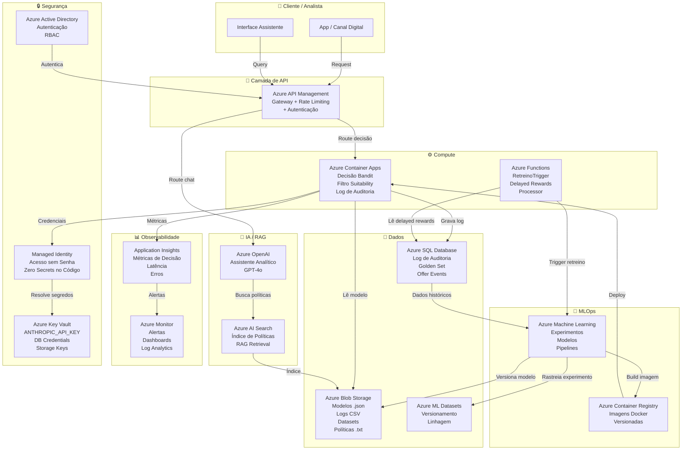

# Arquitetura-Alvo Azure — Plataforma de Experimentação Adaptativa

**Projeto**: Datathon 7MLET  
**Versão**: 1.0  
**Data**: Janeiro/2025  
**Provedor**: Microsoft Azure (exclusivo)

---

## 1. Visão Geral

A solução é operada integralmente em Azure, cobrindo as camadas de
compute, API, dados, IA/RAG, observabilidade, segurança e governança.
Nenhum serviço externo ao ecossistema Azure é utilizado.

---

## 2. Diagrama de Arquitetura



---

## 3. Descrição dos Serviços

### 3.1 Camada de API
| Serviço | Função no Sistema |
|---------|------------------|
| Azure API Management | Gateway central: autenticação, rate limiting, roteamento para decisão ou chat |

### 3.2 Compute
| Serviço | Função no Sistema |
|---------|------------------|
| Azure Container Apps | Hospeda o decisor (bandit + suitability + log). Escala automaticamente por demanda |
| Azure Functions | Processa delayed rewards e dispara retreino quando critérios são atingidos |

### 3.3 IA / RAG
| Serviço | Função no Sistema |
|---------|------------------|
| Azure OpenAI (GPT-4o) | LLM do assistente analítico. Responde perguntas sobre decisões e políticas |
| Azure AI Search | Indexa os documentos de política interna para recuperação semântica (RAG) |

### 3.4 Dados
| Serviço | Função no Sistema |
|---------|------------------|
| Azure Blob Storage | Armazena modelos (.json), logs (.csv), datasets e documentos de política (.txt) |
| Azure SQL Database | Persiste o log de auditoria, golden set e offer events com consulta estruturada |
| Azure ML Datasets | Versiona os datasets com linhagem rastreável para reprodutibilidade |

### 3.5 MLOps
| Serviço | Função no Sistema |
|---------|------------------|
| Azure Machine Learning | Rastreia experimentos, versiona modelos, executa pipelines de retreino |
| Azure Container Registry | Armazena imagens Docker versionadas do decisor para deploy controlado |

### 3.6 Observabilidade
| Serviço | Função no Sistema |
|---------|------------------|
| Application Insights | Coleta métricas de cada decisão: latência, taxa de conversão, erros |
| Azure Monitor | Consolida alertas e dashboards. Notifica quando drift ou anomalia é detectada |

### 3.7 Segurança
| Serviço | Função no Sistema |
|---------|------------------|
| Azure Key Vault | Centraliza todos os segredos: chaves de API, credenciais de banco, storage keys |
| Managed Identity | Permite que o Container Apps acesse Key Vault e Storage sem credenciais no código |
| Azure Active Directory | Autenticação de usuários e RBAC para controle de acesso por papel |

---

## 4. Fluxo de Decisão em Produção

```
1. Cliente acessa canal digital
        ↓
2. Request chega ao Azure API Management
   (autenticação via AAD, rate limiting aplicado)
        ↓
3. APIM roteia para Azure Container Apps
        ↓
4. Container Apps executa:
   a) Verifica suitability (regras locais)
   b) Consulta modelo no Blob Storage
   c) Bandit decide (0 ou 1)
   d) Grava decisão no Azure SQL
   e) Envia métricas ao Application Insights
        ↓
5. Retorna decisão ao cliente
        ↓
6. [Assíncrono] Azure Functions processa
   recompensa observada e atualiza o modelo
```

---

## 5. Fluxo do Assistente Analítico

```
1. Analista envia pergunta via interface
        ↓
2. APIM roteia para Azure OpenAI
        ↓
3. Azure OpenAI busca contexto no Azure AI Search
   (políticas internas indexadas semanticamente)
        ↓
4. Azure OpenAI consulta log de auditoria no Azure SQL
        ↓
5. Gera resposta fundamentada em dados reais
        ↓
6. Retorna resposta ao analista
```

---

## 6. Fluxo de Retreino (MLOps)

```
1. Azure Monitor detecta drift de recompensa
        ↓
2. Dispara Azure Functions (retreino trigger)
        ↓
3. Azure ML Pipeline executa:
   a) Carrega dados históricos do Azure SQL
   b) Retreina o bandit com histórico atualizado
   c) Avalia contra golden set
   d) Aguarda aprovação humana (approval gate)
        ↓
4. [Se aprovado] Azure ML versiona o modelo
        ↓
5. Novo modelo publicado no Blob Storage
        ↓
6. Container Apps recarrega modelo na próxima inicialização
```

---

## 7. Gestão de Segredos

Todos os segredos são gerenciados via Azure Key Vault com Managed Identity:

```python
# Exemplo de acesso sem credencial no código
from azure.identity import ManagedIdentityCredential
from azure.keyvault.secrets import SecretClient

credential = ManagedIdentityCredential()
client = SecretClient(
    vault_url="https://lastech-kv.vault.azure.net/",
    credential=credential
)

anthropic_key = client.get_secret("ANTHROPIC-API-KEY").value
```

**Segredos armazenados no Key Vault**:
- `ANTHROPIC-API-KEY` — chave da API do assistente analítico
- `SQL-CONNECTION-STRING` — conexão com Azure SQL
- `STORAGE-ACCOUNT-KEY` — acesso ao Blob Storage
- `AML-WORKSPACE-KEY` — acesso ao Azure Machine Learning

---

## 8. Estimativa Qualitativa de Custo

| Serviço | Tier Recomendado | Custo Estimado/mês |
|---------|-----------------|-------------------|
| Azure Container Apps | Consumption | ~$20-50 (por demanda) |
| Azure API Management | Developer | ~$50 |
| Azure OpenAI (GPT-4o) | Pay-per-use | ~$30-100 (por volume) |
| Azure AI Search | Basic | ~$75 |
| Azure SQL Database | Basic (5 DTU) | ~$5 |
| Azure Blob Storage | LRS Standard | ~$5 |
| Azure Machine Learning | Basic | ~$0 (compute separado) |
| Application Insights | Pay-per-use | ~$10-20 |
| Azure Key Vault | Standard | ~$5 |
| **Total estimado** | | **~$200-310/mês** |

*Estimativas para ambiente de desenvolvimento/demonstração com tráfego baixo.*
*Produção real com alto volume pode custar 10-50x mais dependendo da escala.*

---

## 9. Trade-offs e Alternativas Descartadas

| Decisão | Alternativa Descartada | Motivo da Escolha |
|---------|----------------------|------------------|
| Container Apps | Azure Kubernetes Service | AKS é mais complexo para escala pequena |
| Azure OpenAI | API Anthropic direta | Azure OpenAI mantém dados no tenant do cliente |
| Azure SQL | Cosmos DB | SQL é suficiente para volume atual; menor custo |
| Azure AI Search | Pinecone / Weaviate | Fora do ecossistema Azure — não permitido |
| Managed Identity | Service Principal com senha | Managed Identity é mais segura — zero secrets |

---

## 10. Cenários de Escala

**Baixo volume** (< 1.000 req/dia):
- Container Apps em consumption plan
- Azure SQL Basic
- Custo ~$200/mês

**Médio volume** (1.000-100.000 req/dia):
- Container Apps com min replicas = 2
- Azure SQL Standard S2
- Application Insights com sampling
- Custo ~$800-1.500/mês

**Alto volume** (> 100.000 req/dia):
- Container Apps com auto-scaling agressivo
- Azure SQL Premium ou Hyperscale
- Azure CDN para cache de decisões frequentes
- Custo ~$5.000+/mês
